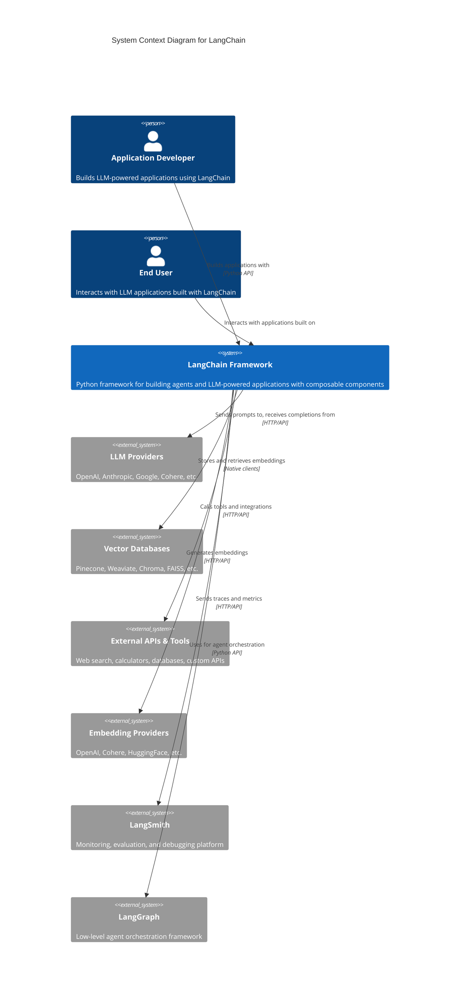

# C4 Level 1: System Context Diagram

This diagram shows the LangChain system in the context of its users and external systems.

## Key Elements

### Users
- **Application Developer**: Uses LangChain to build LLM applications with chains, agents, and RAG systems
- **End User**: Interacts with the final applications (chatbots, search systems, etc.)

### External Systems
- **LLM Providers**: Core language models (GPT-4, Claude, Gemini, etc.)
- **Vector Databases**: Store and retrieve document embeddings for semantic search
- **External APIs & Tools**: Extend agent capabilities with real-world actions
- **Embedding Providers**: Convert text to vector representations
- **LangSmith**: Production monitoring and debugging
- **LangGraph**: Advanced agent workflows with state management

## System Boundary

LangChain acts as an orchestration layer that:
1. Provides unified interfaces to multiple LLM providers
2. Manages data flow between components
3. Handles prompt templating and output parsing
4. Coordinates tool calling and agent execution
5. Integrates with vector stores for RAG
6. Enables observability through LangSmith
