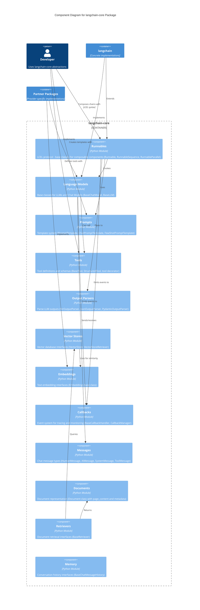

# C4 Level 3: Component Diagram (langchain-core)

This diagram shows the major components within the langchain-core package.

## Core Components

### 1. Runnables (LCEL)
The foundation of LangChain's composability. Key classes:
- `Runnable`: Base protocol with invoke/stream/batch methods
- `RunnableSequence`: Chain components sequentially (pipe operator `|`)
- `RunnableParallel`: Execute components in parallel
- `RunnablePassthrough`: Pass input through unchanged
- `RunnableLambda`: Wrap arbitrary functions

**Purpose**: Universal interface for all LangChain components

### 2. Language Models
Base abstractions for AI models:
- `BaseChatModel`: Chat-based models (messages in/out)
- `BaseLLM`: Text completion models (string in/out)
- Methods: `invoke()`, `stream()`, `batch()`, `ainvoke()` (async)

**Purpose**: Provider-agnostic model interface

### 3. Prompts
Template system for dynamic prompts:
- `PromptTemplate`: String-based templates with variables
- `ChatPromptTemplate`: Message-based templates
- `FewShotPromptTemplate`: Examples-based prompting
- `MessagesPlaceholder`: Dynamic message insertion

**Purpose**: Reusable, parameterized prompts

### 4. Tools
Function calling and tool integration:
- `BaseTool`: Abstract tool interface
- `StructuredTool`: Tools with Pydantic schemas
- `@tool` decorator: Convert functions to tools
- Tool schemas define inputs/outputs

**Purpose**: Extend LLM capabilities with external functions

### 5. Output Parsers
Parse and validate LLM outputs:
- `StrOutputParser`: Extract string content
- `JsonOutputParser`: Parse JSON responses
- `PydanticOutputParser`: Validate with Pydantic models
- `CommaSeparatedListOutputParser`: Parse lists

**Purpose**: Structure unstructured LLM outputs

### 6. Vector Stores
Embedding storage and retrieval:
- `VectorStore`: Base interface for vector databases
- `VectorStoreRetriever`: Query interface
- Methods: `add_documents()`, `similarity_search()`, `as_retriever()`

**Purpose**: Semantic search for RAG applications

### 7. Embeddings
Text-to-vector conversion:
- `Embeddings`: Base interface
- Methods: `embed_documents()`, `embed_query()`

**Purpose**: Convert text to numerical representations

### 8. Callbacks
Event system for observability:
- `BaseCallbackHandler`: Event listener interface
- `CallbackManager`: Coordinate multiple handlers
- Events: on_llm_start, on_llm_end, on_chain_start, etc.

**Purpose**: Tracing, logging, and monitoring

### 9. Messages
Chat message types:
- `HumanMessage`: User input
- `AIMessage`: Model response
- `SystemMessage`: System instructions
- `ToolMessage`: Tool execution results
- `FunctionMessage`: Function call results

**Purpose**: Structured chat conversations

### 10. Documents
Document representation:
- `Document`: Contains `page_content` (text) and `metadata` (dict)

**Purpose**: Standardized document format

### 11. Retrievers
Document retrieval interface:
- `BaseRetriever`: Abstract retriever
- Methods: `get_relevant_documents()`, `aget_relevant_documents()`

**Purpose**: Fetch relevant documents for RAG

### 12. Memory
Conversation history:
- `BaseChatMessageHistory`: Store/retrieve messages
- Methods: `add_message()`, `get_messages()`, `clear()`

**Purpose**: Maintain conversation context

## Component Interactions

1. **LCEL Chains**: Runnables compose Prompts → Language Models → Output Parsers
2. **RAG Pipeline**: Retrievers query Vector Stores using Embeddings, results feed Language Models
3. **Agent Loop**: Language Models call Tools, results processed by Output Parsers
4. **Observability**: All components emit events to Callbacks
5. **Chat Applications**: Messages flow through Language Models with Memory
