# C4 Level 4: Code Diagram (Runnables)

This diagram shows the key classes and relationships within the Runnables subsystem.

```mermaid
classDiagram
    class Runnable~Input, Output~ {
        <<abstract>>
        +invoke(input: Input, config: RunnableConfig) Output
        +ainvoke(input: Input, config: RunnableConfig) Output
        +batch(inputs: List[Input], config: RunnableConfig) List[Output]
        +abatch(inputs: List[Input], config: RunnableConfig) List[Output]
        +stream(input: Input, config: RunnableConfig) Iterator[Output]
        +astream(input: Input, config: RunnableConfig) AsyncIterator[Output]
        +astream_log(input: Input, config: RunnableConfig) AsyncIterator[RunLogPatch]
        +astream_events(input: Input, config: RunnableConfig) AsyncIterator[StreamEvent]
        +with_retry(stop_after_attempt: int) RunnableWithRetry
        +with_fallbacks(fallbacks: List[Runnable]) RunnableWithFallbacks
        +with_config(config: RunnableConfig) RunnableBinding
        +with_listeners(on_start, on_end, on_error) RunnableWithListeners
        +pipe(other: Runnable) RunnableSequence
        +input_schema() Type[BaseModel]
        +output_schema() Type[BaseModel]
        +config_schema() Type[BaseModel]
    }

    class RunnableSequence~Input, Output~ {
        -first: Runnable
        -middle: List[Runnable]
        -last: Runnable
        +invoke(input: Input, config: RunnableConfig) Output
        +batch(inputs: List[Input], config: RunnableConfig) List[Output]
        +stream(input: Input, config: RunnableConfig) Iterator[Output]
    }

    class RunnableParallel~Input, Output~ {
        -steps: Dict[str, Runnable]
        +invoke(input: Input, config: RunnableConfig) Dict[str, Output]
        +batch(inputs: List[Input], config: RunnableConfig) List[Dict[str, Output]]
    }

    class RunnableLambda~Input, Output~ {
        -func: Callable
        -afunc: Optional[Callable]
        +invoke(input: Input, config: RunnableConfig) Output
        +ainvoke(input: Input, config: RunnableConfig) Output
    }

    class RunnablePassthrough~Input~ {
        -func: Optional[Callable]
        +invoke(input: Input, config: RunnableConfig) Input
        +assign(**kwargs) RunnablePassthrough
    }

    class RunnableBinding~Input, Output~ {
        -bound: Runnable
        -config: RunnableConfig
        -kwargs: Dict
        +invoke(input: Input, config: RunnableConfig) Output
    }

    class RunnableWithRetry~Input, Output~ {
        -bound: Runnable
        -stop_after_attempt: int
        -wait_exponential_jitter: bool
        +invoke(input: Input, config: RunnableConfig) Output
    }

    class RunnableWithFallbacks~Input, Output~ {
        -runnable: Runnable
        -fallbacks: List[Runnable]
        +invoke(input: Input, config: RunnableConfig) Output
    }

    class RunnableBranch~Input, Output~ {
        -branches: List[Tuple[Callable, Runnable]]
        -default: Runnable
        +invoke(input: Input, config: RunnableConfig) Output
    }

    class RunnableConfig {
        +tags: List[str]
        +metadata: Dict[str, Any]
        +callbacks: List[BaseCallbackHandler]
        +run_name: str
        +max_concurrency: int
        +recursion_limit: int
        +configurable: Dict[str, Any]
    }

    Runnable <|-- RunnableSequence : extends
    Runnable <|-- RunnableParallel : extends
    Runnable <|-- RunnableLambda : extends
    Runnable <|-- RunnablePassthrough : extends
    Runnable <|-- RunnableBinding : extends
    Runnable <|-- RunnableWithRetry : extends
    Runnable <|-- RunnableWithFallbacks : extends
    Runnable <|-- RunnableBranch : extends

    RunnableSequence o-- Runnable : contains
    RunnableParallel o-- Runnable : contains
    RunnableBinding o-- Runnable : wraps
    RunnableWithRetry o-- Runnable : wraps
    RunnableWithFallbacks o-- Runnable : wraps
    RunnableBranch o-- Runnable : contains

    Runnable ..> RunnableConfig : uses
```



## Key Classes

### Runnable (Base Class)
**Location**: `libs/core/langchain_core/runnables/base.py:124`

The abstract base class for all composable components in LangChain. Defines the LCEL protocol.

**Core Methods**:
- `invoke()`: Synchronous single input execution
- `ainvoke()`: Asynchronous single input execution
- `batch()`: Synchronous batch execution
- `abatch()`: Asynchronous batch execution
- `stream()`: Synchronous streaming execution
- `astream()`: Asynchronous streaming execution

**Composition Methods**:
- `pipe()` / `|` operator: Create RunnableSequence
- `with_retry()`: Add retry logic
- `with_fallbacks()`: Add fallback runnables
- `with_config()`: Bind configuration
- `with_listeners()`: Add lifecycle callbacks

**Schema Methods**:
- `input_schema()`: Pydantic model for input validation
- `output_schema()`: Pydantic model for output validation
- `config_schema()`: Configuration schema

### RunnableSequence
**Location**: `libs/core/langchain_core/runnables/base.py`

Chains runnables sequentially. Output of one becomes input to the next.

**Created by**:
- Pipe operator: `runnable1 | runnable2 | runnable3`
- Constructor: `RunnableSequence(first=r1, middle=[r2], last=r3)`

**Example**:
```python
chain = prompt | model | output_parser
result = chain.invoke({"topic": "AI"})
```

### RunnableParallel
**Location**: `libs/core/langchain_core/runnables/base.py`

Executes multiple runnables concurrently with the same input.

**Created by**:
- Dict literal: `{"key1": runnable1, "key2": runnable2}`
- Constructor: `RunnableParallel(steps={"key1": r1, "key2": r2})`

**Example**:
```python
parallel = {
    "summary": summarize_chain,
    "sentiment": sentiment_chain
}
result = parallel.invoke(document)  # {"summary": "...", "sentiment": "..."}
```

### RunnableLambda
**Location**: `libs/core/langchain_core/runnables/base.py`

Wraps arbitrary Python functions as Runnables.

**Example**:
```python
from langchain_core.runnables import RunnableLambda

def extract_title(doc):
    return doc["title"]

chain = RunnableLambda(extract_title) | model
```

### RunnablePassthrough
**Location**: `libs/core/langchain_core/runnables/passthrough.py`

Passes input through unchanged, optionally applying a function or assigning new keys.

**Example**:
```python
from langchain_core.runnables import RunnablePassthrough

# Pass through unchanged
chain = RunnablePassthrough() | model

# Assign new keys
chain = RunnablePassthrough.assign(
    context=retriever,
    question=lambda x: x["question"]
) | prompt | model
```

### RunnableBinding
**Location**: `libs/core/langchain_core/runnables/base.py`

Binds configuration or kwargs to a runnable.

**Created by**: `runnable.with_config(config)`

**Example**:
```python
model_with_temp = model.with_config({"temperature": 0.7})
```

### RunnableWithRetry
**Location**: `libs/core/langchain_core/runnables/retry.py`

Adds retry logic with exponential backoff.

**Created by**: `runnable.with_retry(stop_after_attempt=3)`

**Example**:
```python
reliable_chain = model.with_retry(
    stop_after_attempt=5,
    wait_exponential_jitter=True
)
```

### RunnableWithFallbacks
**Location**: `libs/core/langchain_core/runnables/fallbacks.py`

Tries fallback runnables if the primary fails.

**Created by**: `runnable.with_fallbacks([fallback1, fallback2])`

**Example**:
```python
chain = primary_model.with_fallbacks([
    backup_model,
    simple_model
])
```

### RunnableBranch
**Location**: `libs/core/langchain_core/runnables/branch.py`

Conditional routing based on input.

**Example**:
```python
from langchain_core.runnables import RunnableBranch

branch = RunnableBranch(
    (lambda x: x["type"] == "question", qa_chain),
    (lambda x: x["type"] == "summary", summary_chain),
    default_chain  # default
)
```

### RunnableConfig
**Location**: `libs/core/langchain_core/runnables/config.py`

Configuration object passed to all runnable methods.

**Fields**:
- `tags`: List of tags for filtering traces
- `metadata`: Arbitrary metadata
- `callbacks`: Callback handlers for events
- `run_name`: Name for this run in traces
- `max_concurrency`: Limit concurrent executions
- `recursion_limit`: Prevent infinite recursion
- `configurable`: Runtime configuration values

## Design Patterns

### 1. Protocol Pattern
All runnables implement the same protocol (invoke, stream, batch), enabling universal composition.

### 2. Decorator Pattern
`RunnableBinding`, `RunnableWithRetry`, and `RunnableWithFallbacks` wrap runnables to add behavior.

### 3. Composite Pattern
`RunnableSequence` and `RunnableParallel` compose multiple runnables into complex workflows.

### 4. Strategy Pattern
`RunnableBranch` selects execution strategy based on input.

### 5. Adapter Pattern
`RunnableLambda` adapts arbitrary functions to the Runnable interface.

## Type Safety

Runnables are generic over `Input` and `Output` types:
- Type checkers can verify composition compatibility
- Runtime schema validation via Pydantic
- Automatic schema inference from type hints
