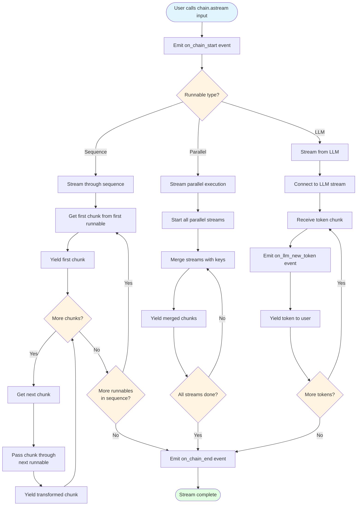
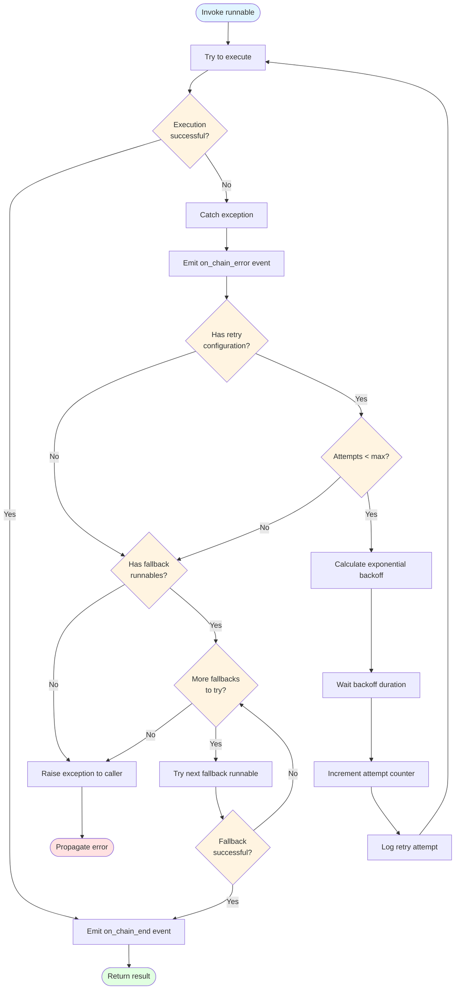
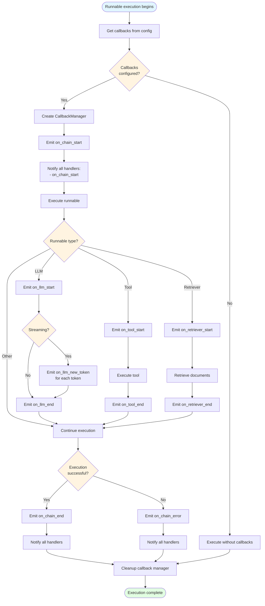

# Additional Flowcharts

## 4. Streaming Flow

This flowchart shows how streaming responses work in LangChain.

**Key Points**:
- Streaming allows incremental output as it's generated
- Sequences stream through each runnable in order
- Parallels merge multiple streams
- LLMs stream token by token
- Events are emitted for observability

---

## 5. Error Handling & Retries

This flowchart shows how LangChain handles errors and retries.

**Key Points**:
- Errors are caught and emitted as events
- Retries use exponential backoff
- Fallbacks are tried in order
- If all retries and fallbacks fail, error propagates
- Each attempt is logged for debugging

---

## 6. Callback System Flow

This flowchart shows how the callback/event system works.

**Key Points**:
- Callbacks are configured via RunnableConfig
- CallbackManager coordinates multiple handlers
- Different events for different component types
- Streaming emits token-by-token events
- All handlers are notified of start, end, and error events
- Callbacks enable tracing, logging, and monitoring

---

## Flow Patterns Summary

### Sequential Flow (LCEL)
Input → Runnable 1 → Runnable 2 → ... → Output

### Parallel Flow
Input → [Runnable A, Runnable B, Runnable C] → {a: Output A, b: Output B, c: Output C}

### Loop Flow (Agent)
Input → LLM → Tool → LLM → Tool → ... → Final Answer

### Streaming Flow
Input → Runnable → Chunk 1 → Chunk 2 → ... → Complete

### Error Flow
Try → Error → Retry → Error → Fallback → Success/Error

### Event Flow
Start → Execute → Events → End → Callbacks