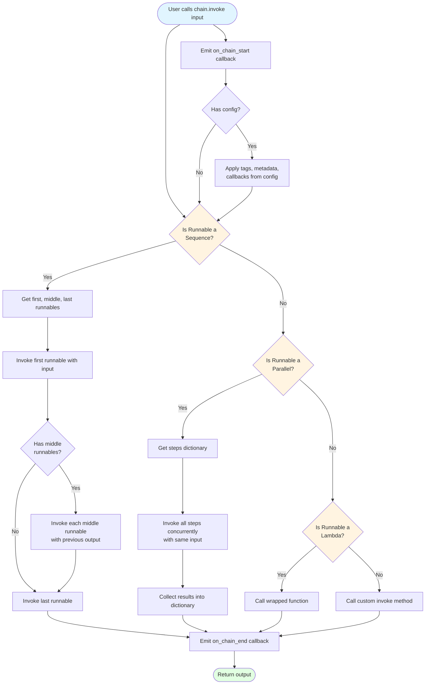
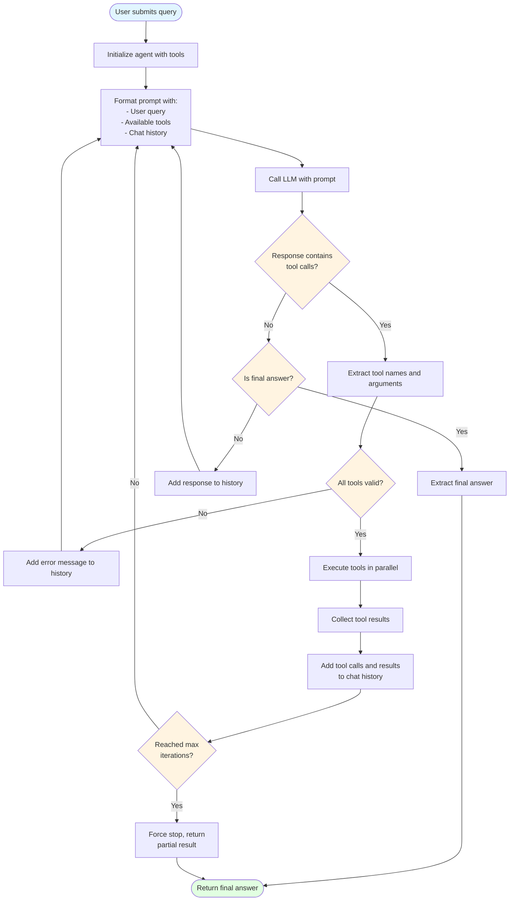

# Flowcharts for Key LangChain Processes

## 1. LCEL Execution Flow

This flowchart shows how a Runnable chain is executed using the LCEL protocol.



**Key Points**:
- All runnables emit callbacks at start and end
- Configuration (tags, metadata, callbacks) is applied before execution
- Sequences execute steps in order, passing output to next input
- Parallels execute all steps concurrently with the same input
- Lambdas wrap arbitrary functions

---

## 2. Agent Execution Loop

This flowchart shows the ReAct agent pattern with tool calling.



**Key Points**:
- Agent loops until it produces a final answer or hits max iterations
- Tools are validated before execution
- Tool results are added to chat history for context
- LLM decides when to stop by returning a final answer
- Errors are fed back to the LLM for correction

---

## 3. RAG Pipeline Flow

This flowchart shows the Retrieval Augmented Generation process.

```mermaid
flowchart TD
    Start([User submits query]) --> EmbedQuery[Generate query embedding]
    EmbedQuery --> SearchVectorDB[Search vector database<br/>for similar documents]

    SearchVectorDB --> RetrieveDocs[Retrieve top-k documents]
    RetrieveDocs --> CheckDocs{Documents found?}

    CheckDocs -->|No| NoDocsMsg[Return "No relevant<br/>documents found"]
    CheckDocs -->|Yes| FormatDocs[Format documents:<br/>- Extract page_content<br/>- Add metadata<br/>- Join with separators]

    FormatDocs --> BuildPrompt[Build prompt with:<br/>- System instructions<br/>- Retrieved context<br/>- User query]

    BuildPrompt --> CallLLM[Call LLM with context]
    CallLLM --> ParseResponse[Parse LLM response]
    ParseResponse --> CheckCitations{Include citations?}

    CheckCitations -->|Yes| AddSources[Add source metadata<br/>to response]
    CheckCitations -->|No| ReturnAnswer

    AddSources --> ReturnAnswer([Return answer with sources])
    NoDocsMsg --> ReturnAnswer

    style Start fill:#e1f5ff
    style ReturnAnswer fill:#e1ffe1
    style CheckDocs fill:#fff4e1
    style CheckCitations fill:#fff4e1
```

**Key Points**:
- Query is embedded using the same model as documents
- Vector database returns most similar documents
- Documents are formatted and injected into prompt
- LLM generates answer based on retrieved context
- Sources can be included for transparency

---
