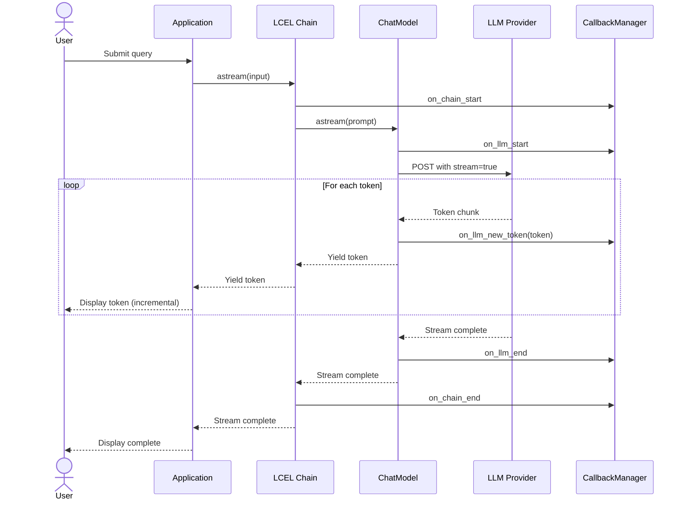
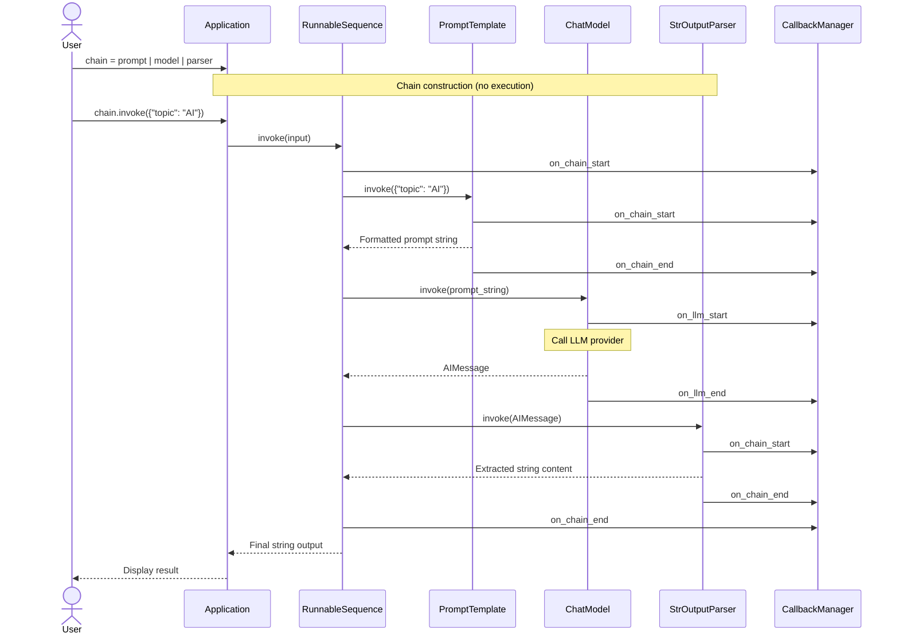
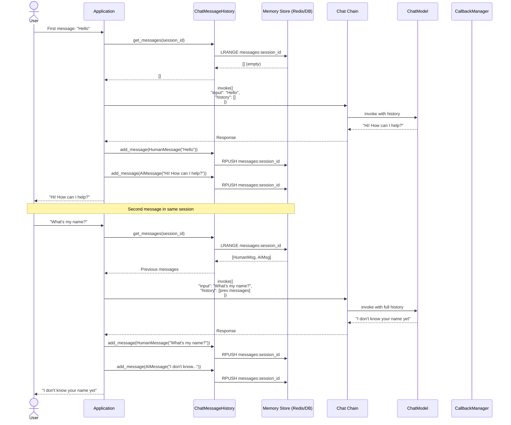

# Additional Sequence Diagrams

## 4. Streaming Response

This sequence diagram shows streaming token-by-token responses.

**Flow**:
1. User submits query
2. Application calls astream() for streaming
3. Model connects to provider with streaming enabled
4. Each token is yielded as it arrives
5. User sees incremental updates in real-time
6. Stream completes when all tokens received

---

## 5. LCEL Chain Composition

This sequence diagram shows how LCEL chains compose multiple components.

**Flow**:
1. User constructs chain using pipe operator
2. Chain is invoked with input
3. Each component processes output from previous step
4. Prompt formats input → Model generates response → Parser extracts content
5. Final output returned to user
6. Each step emits callbacks for tracing

---

## 6. Memory Integration

This sequence diagram shows conversation memory in action.

**Flow**:
1. First message: Memory is empty
2. Response generated without context
3. Both user and AI messages saved to memory
4. Second message: Previous messages loaded from memory
5. Full conversation history included in prompt
6. LLM has context from previous interaction
7. New messages appended to memory

---

## Interaction Patterns Summary

### Request-Response Pattern
User → App → LLM → App → User

### Retrieval Pattern
User → App → VectorDB → App → LLM → App → User

### Tool Calling Pattern
User → App → LLM → Tool → LLM → App → User

### Streaming Pattern
User → App → LLM → (Token → User)* → Complete

### Sequential Processing Pattern
Input → Component1 → Component2 → Component3 → Output

### Memory Pattern
User → Load History → LLM with Context → Save History → User

## Key Observations

1. **Callbacks are pervasive**: Every operation emits events for observability
2. **Async by default**: Most operations support both sync and async
3. **Composability**: Components chain together seamlessly
4. **Stateless execution**: State (like memory) is explicitly managed
5. **Provider abstraction**: LLM providers are interchangeable
6. **Streaming support**: Built into the protocol at every level