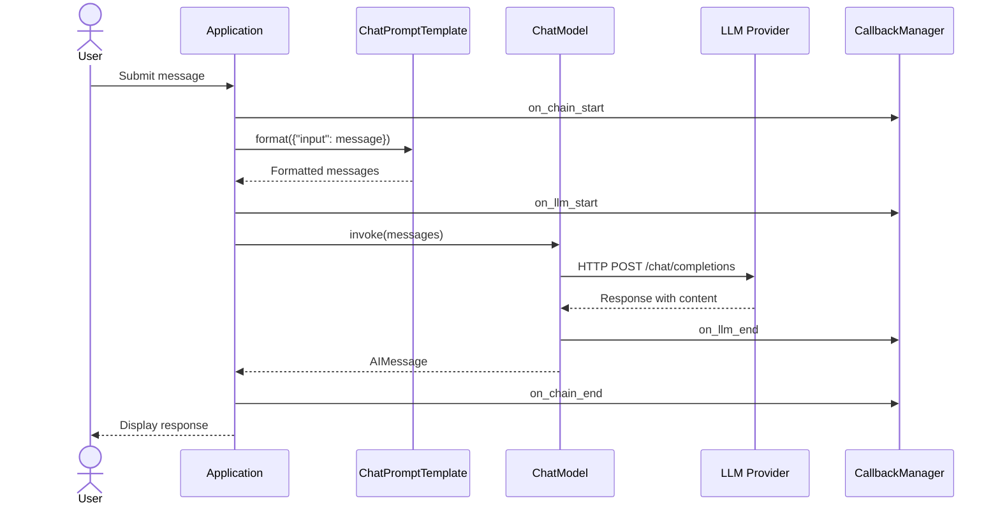
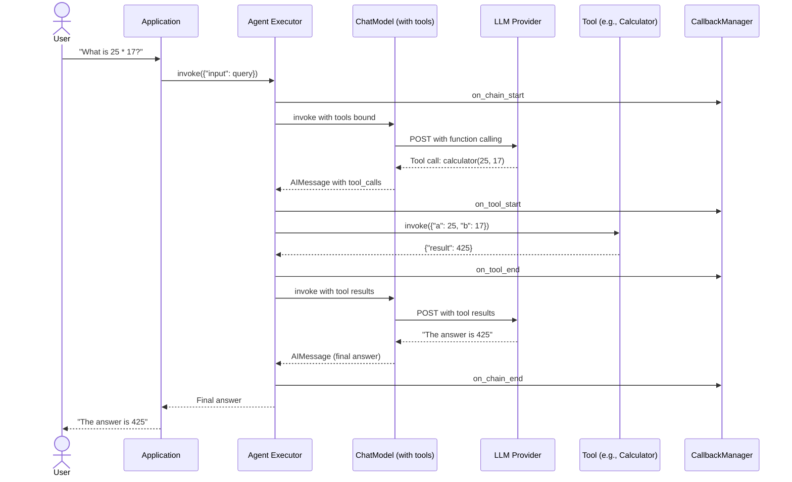
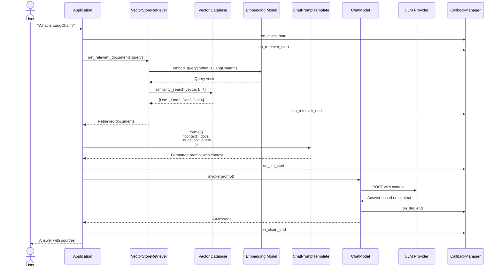

# Sequence Diagrams for LangChain Interactions

## 1. Simple Chat Completion

This sequence diagram shows a basic chat interaction.

**Flow**:
1. User submits a message
2. Application formats message using prompt template
3. Formatted messages sent to chat model
4. Model calls external LLM provider
5. Response returned and displayed to user
6. Callbacks track the entire flow

---

## 2. Agent with Tools

This sequence diagram shows an agent using tools to answer a question.

**Flow**:
1. User asks a question requiring calculation
2. Agent sends query to LLM with available tools
3. LLM decides to use calculator tool
4. Agent executes tool and gets result
5. Agent sends tool result back to LLM
6. LLM formulates final answer
7. Answer returned to user

---

## 3. RAG Query

This sequence diagram shows a retrieval-augmented generation query.

**Flow**:
1. User submits a question
2. Query is embedded and used to search vector database
3. Most relevant documents are retrieved
4. Documents are formatted into prompt as context
5. LLM generates answer based on retrieved context
6. Answer (optionally with sources) returned to user

---
