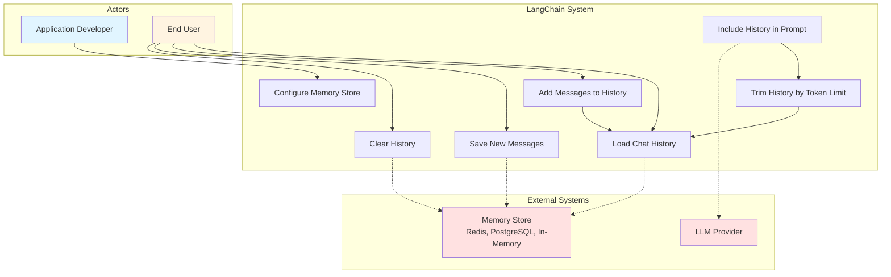
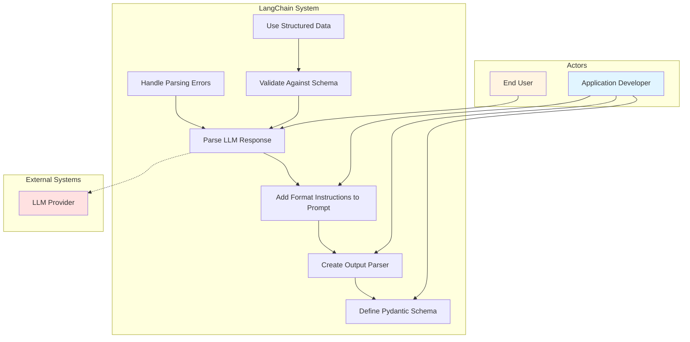
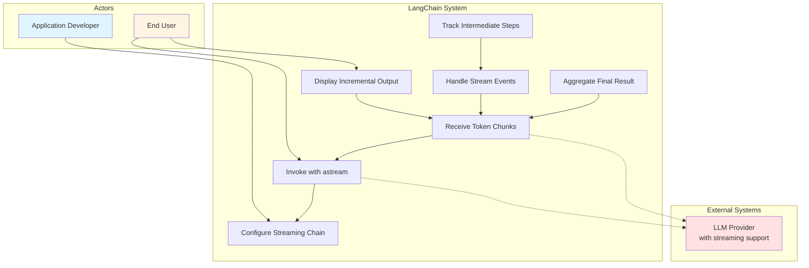
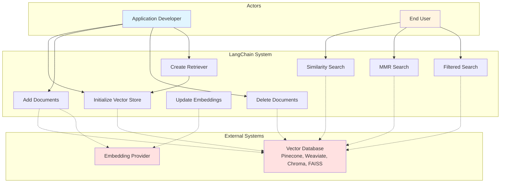

# Additional Use Case Diagrams

## 5. Implement Conversation Memory

**Primary Actor**: Application Developer, End User
**Goal**: Maintain conversation context across multiple interactions
**Components Used**: BaseChatMessageHistory, ChatMessageHistory, RunnableWithMessageHistory

---

## 6. Parse Structured Output

**Primary Actor**: Application Developer, End User
**Goal**: Extract structured data from LLM responses
**Components Used**: PydanticOutputParser, JsonOutputParser, StructuredOutputParser

---

## 7. Stream Responses

**Primary Actor**: Application Developer, End User
**Goal**: Provide real-time feedback as LLM generates responses
**Components Used**: astream(), astream_events(), StreamingCallbackHandler

---

## 8. Integrate with Vector Databases

**Primary Actor**: Application Developer, End User
**Goal**: Store and retrieve documents using semantic similarity
**Components Used**: VectorStore, Embeddings, VectorStoreRetriever

---

## Actor Descriptions

### Application Developer
- Configures and builds LangChain applications
- Defines schemas, prompts, and chains
- Integrates external services
- Deploys and maintains applications

### End User
- Interacts with deployed applications
- Submits queries and receives responses
- Provides feedback through the application

### External Systems
- **LLM Providers**: OpenAI, Anthropic, Google, Cohere, etc.
- **Vector Databases**: Pinecone, Weaviate, Chroma, FAISS, etc.
- **Memory Stores**: Redis, PostgreSQL, in-memory stores
- **External APIs**: Web search, calculators, databases, custom services
- **Embedding Providers**: OpenAI, Cohere, HuggingFace, etc.

## Common Patterns

1. **Setup Phase** (Developer): Configure components, define schemas, build chains
2. **Execution Phase** (User): Invoke chains, receive results
3. **Integration Phase** (System): Communicate with external services
4. **Monitoring Phase** (Developer): Track performance, debug issues

## Use Case Relationships

- **Extends**: RAG extends Simple Chatbot with document retrieval
- **Includes**: Agent with Tools includes Chain Multiple LLM Calls
- **Depends On**: Most use cases depend on Parse Structured Output and Stream Responses
- **Combines**: Production applications often combine Memory + RAG + Streaming