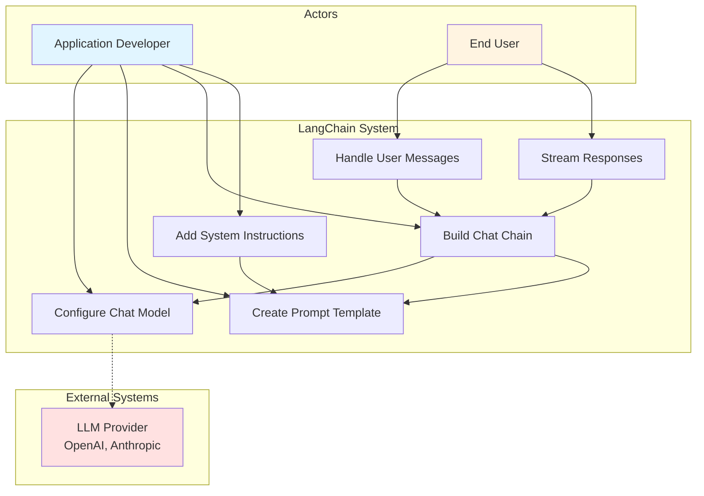
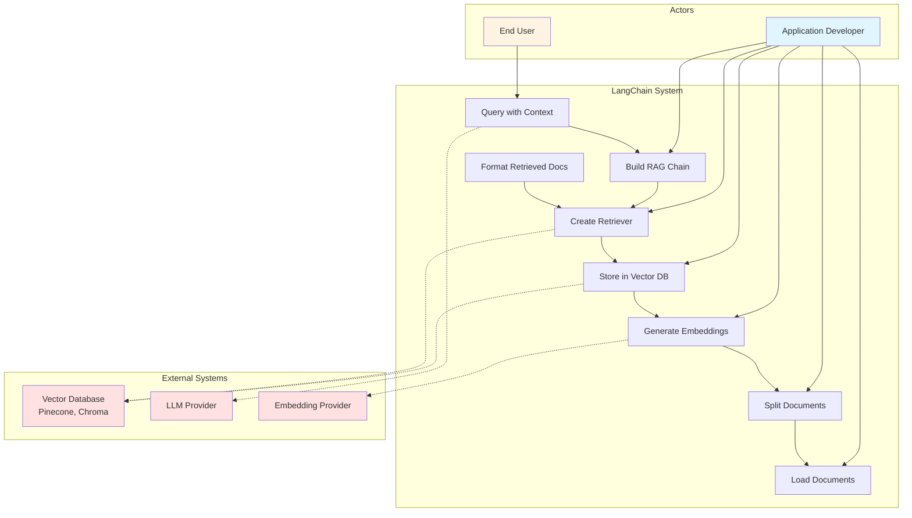
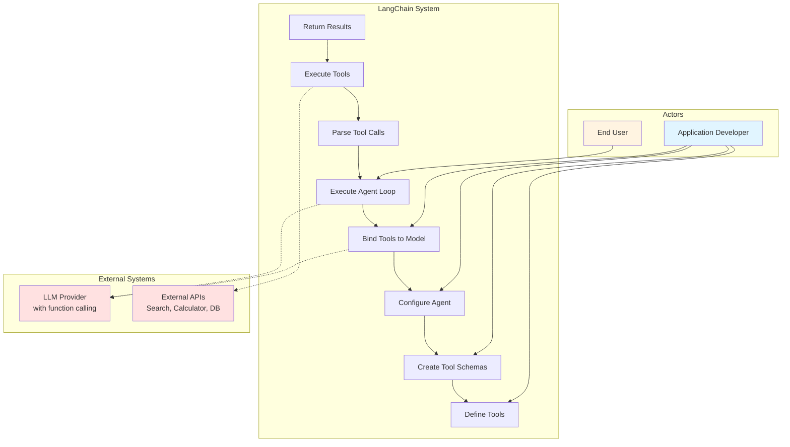
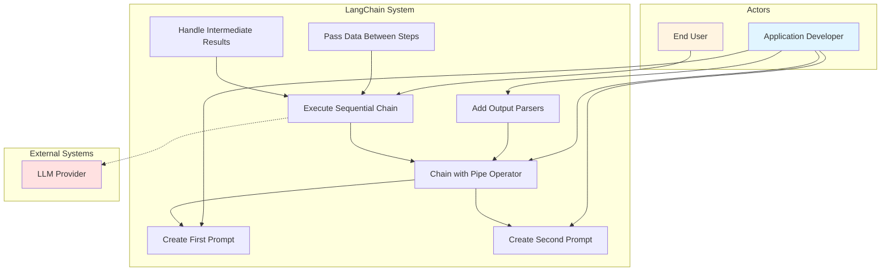

# Use Case Diagrams

This document contains use case diagrams for common LangChain application patterns.

## 1. Build a Simple Chatbot

**Primary Actor**: Application Developer, End User
**Goal**: Create an interactive chatbot with streaming responses
**Components Used**: ChatPromptTemplate, ChatModel, LCEL chains

---

## 2. Create a RAG Application

**Primary Actor**: Application Developer, End User
**Goal**: Build a question-answering system over custom documents
**Components Used**: DocumentLoaders, TextSplitters, Embeddings, VectorStores, Retrievers, LCEL chains

---

## 3. Build an Agent with Tools

**Primary Actor**: Application Developer, End User
**Goal**: Create an agent that can use tools to accomplish tasks
**Components Used**: BaseTool, StructuredTool, ChatModel with tool binding, Agent executors

---

## 4. Chain Multiple LLM Calls

**Primary Actor**: Application Developer, End User
**Goal**: Create multi-step workflows with sequential LLM calls
**Components Used**: ChatPromptTemplate, ChatModel, OutputParsers, RunnableSequence (LCEL)
